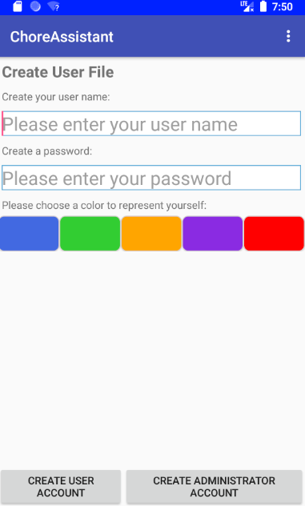
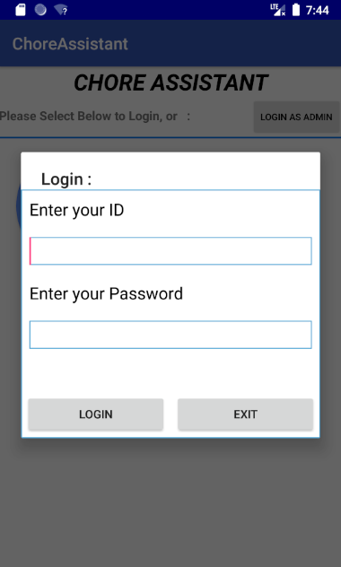
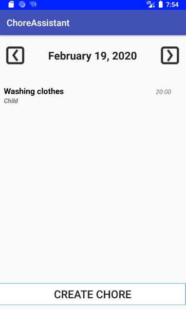
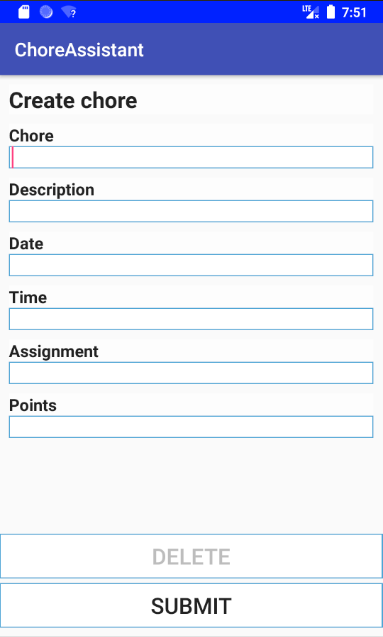
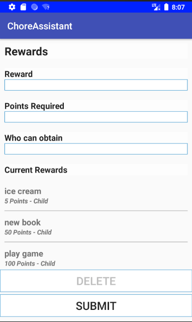

# ChoreAssistant

## Java-based Android project

The main outcome of the project is the implementation of a household chore management application for android devices.
 
## Technologies Used

The project is written in Java, built using the Android Studio 2.3, and constructed with firebase to store data. Multiple tasks, including design specification, use-cases, UML documentation, graphical assets, and source code are implemented.
 
## Demo

Different screen shots of app are performed, such as login and sign up page, home page, control panel page, chore creation page, chore assigning page, reward page etc. 

 

<pre></pre>

<pre></pre>

<pre></pre>

<pre></pre>

